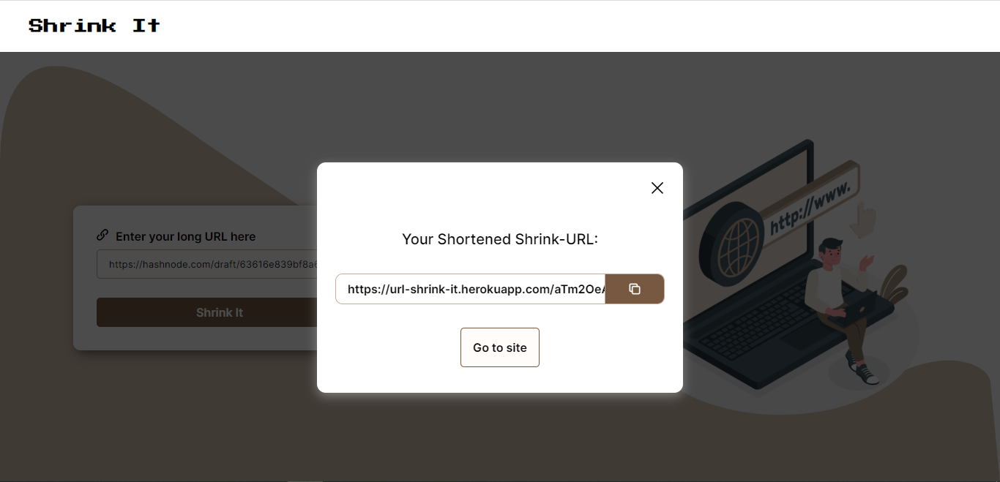

# Shrink It

This is a simple URL shortener that help you shorten all your long URLs.

You can read about our experience [here](https://stammy.hashnode.dev/url-shortener)

## :page_facing_up: Table of contents

- [Shrink It](#shrink-it)
  - [:page\_facing\_up: Table of contents](#page_facing_up-table-of-contents)
  - [:camera: Screenshots](#camera-screenshots)
  - [:signal\_strength: Technologies](#signal_strength-technologies)
  - [:cool: Live-Solution](#cool-live-solution)
  - [:envelope: Contact](#envelope-contact)
  - [:pen: Contributors](#pen-contributors)

## :camera: Screenshots

## :signal_strength: Technologies

* [ReactJS](https://reactjs.org/) 
* [CSS](https://developer.mozilla.org/en-US/docs/Web/CSS) for styling.
* [Javascript](https://www.javascript.com/) for adding functionalities and making it interactive.
* [Vercel](https://www.vercel.co/) for hosting the project.

## :cool: Live-Solution

* Here is the [link](https://url-shortener-one-black.vercel.app/) to the site.

## :envelope: Contact

* Repo created by [Moyinoluwa](https://github.com/moyinoluwa-10/), email: moyinadelowo@gmail.com

## :pen: Contributors

* [Moyinoluwa](https://github.com/moyinoluwa-10/)
* [Stephen](https://github.com/stephen-gift/)

